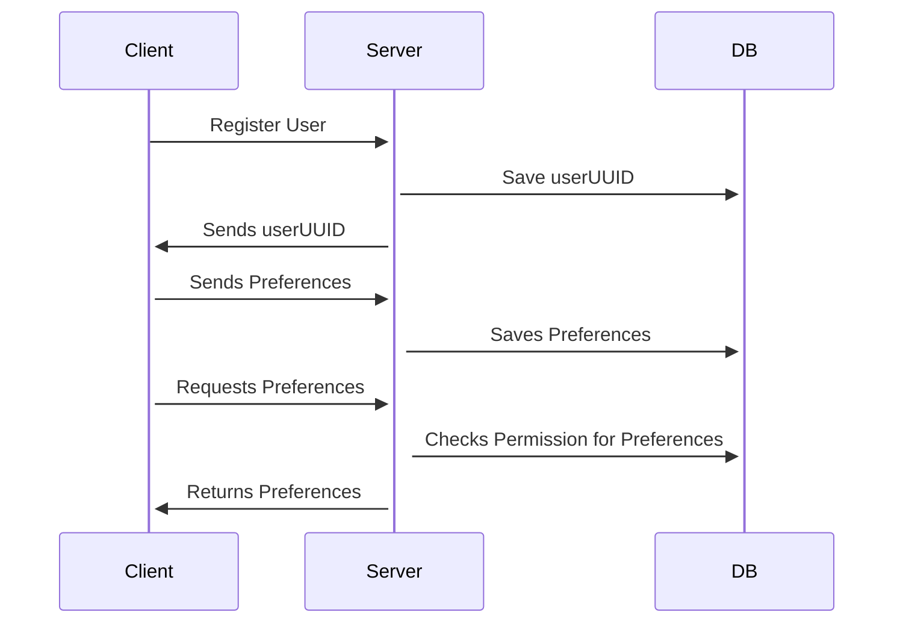
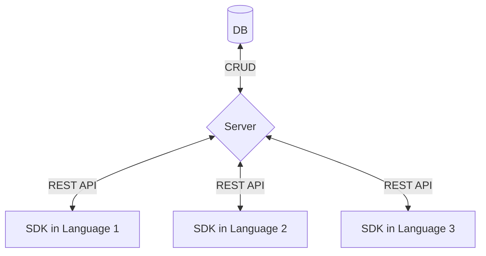

# Pref

*Pref* (short for preferences) utilizes the [Sessionless][sessionless] protocol to provide developers with a place to store user preferences. 
It defaults to preferences which are scoped to a context via a supplied hash.
This hash allows developers to scope preferenes to clients within their ecosystems.

What's novel about Pref is that preferences can be scoped globally, and made available to _all_ apps that interact with Pref. 
This would allow a user to require biometrics before making a payment across multiple apps rather than having to set that in each app individually.

*NOTE* Globally accessible preferences must be flat String to String maps.

## Overview

Pref is composed of a CRUD server and database pair, and companion client-side libraries.
This repo defines the contract between client and server via REST API, provides database implementation(s) for storing the models used in that contract, and the methods necessary in a client implementation.

The typical usage will look something like:



And here's what the architecture looks like:



## API

It doesn't get much CRUDier than this API:

<details>
 <summary><code>POST</code> <code><b>/user/create</b></code> <code>Creates a new user if pubKey does not exist, and returns existing uuid if it does.
signature message is: timestamp + pubKey + hash</code></summary>

##### Parameters

> | name         |  required     | data type               | description                                                           |
> |--------------|-----------|-------------------------|-----------------------------------------------------------------------|
> | pubKey    |  true     | string (hex)            | the publicKey of the user's keypair  |
> | timestamp    |  true     | string                  | in a production system timestamps prevent replay attacks  |
> | hash         |  true     | string                  | the state hash to save for the user
> | signature    |  true     | string (signature)      | the signature from sessionless for the message  |


##### Responses

> | http code     | content-type                      | response                                                            |
> |---------------|-----------------------------------|---------------------------------------------------------------------|
> | `200`         | `application/json`                | `{"userUUID": <uuid>}`   |
> | `400`         | `application/json`                | `{"code":"400","message":"Bad Request"}`                            |

##### Example cURL

> ```javascript
>  curl -X PUT -H "Content-Type: application/json" -d '{"pubKey": "key", "timestamp": "now", "signature": "sig"}' https://pref.planetnine.app/user/create
> ```

</details>

<details>
  <summary><code>PUT</code> <code><b>/user/:uuid/preferences</b></code> <code>Puts a user's preferences
signature message is:  timestamp + userUUID + hash</code></summary>

##### Parameters

> | name         |  required     | data type               | description                                                           |
> |--------------|-----------|-------------------------|-----------------------------------------------------------------------|
> | timestamp    |  true     | string                  | in a production system timestamps prevent replay attacks  |
> | userUUID     |  true     | string                  | the user's uuid
> | hash         |  true     | string                  | the old hash to replace
> | preferences  |  true     | object                  | the preferences to save
> | signature    |  true     | string (signature)      | the signature from sessionless for the message  |


##### Responses

> | http code     | content-type                      | response                                                            |
> |---------------|-----------------------------------|---------------------------------------------------------------------|
> | `200`         | `application/json`                | `<preferences>`   |
> | `400`         | `application/json`                | `{"code":"400","message":"Bad Request"}`                            |

##### Example cURL

> ```javascript
>  curl -X POST -H "Content-Type: application/json" -d '{"timestamp": "right now", "userUUID": "uuid", "hash": "hash", "preferences": {"foo": "bar"}, "signature": "signature"}' https://pref.planetnine.app/user/update-hash
> ```

</details>

<details>
 <summary><code>GET</code> <code><b>/user/:uuid/preferences?timestamp=<timestamp>&hash=<hash>&signature=<signature of (timestamp + uuid + hash)></b></code> <code>Gets a user's preferences.</code></summary>

##### Parameters

> | name         |  required     | data type               | description                                                           |
> |--------------|-----------|-------------------------|-----------------------------------------------------------------------|
> | timestamp    |  true     | string                  | in a production system timestamps prevent replay attacks  |
> | hash         |  true     | string                  | the state hash saved client side
> | signature    |  true     | string (signature)      | the signature from sessionless for the message  |


##### Responses

> | http code     | content-type                      | response                                                            |
> |---------------|-----------------------------------|---------------------------------------------------------------------|
> | `200`         | `application/json`                | `{"userUUID": <uuid>}`   |
> | `406`         | `application/json`                | `{"code":"406","message":"Not acceptable"}`                            |

##### Example cURL

> ```javascript
>  curl -X GET -H "Content-Type: application/json" https://www.continuebee.com/<uuid>?timestamp=123&hash=hash&signature=signature 
> ```

</details>

<details>
  <summary><code>PUT</code> <code><b>/user/:uuid/global/preferences</b></code> <code>Puts a user's globally available preferences
signature message is:  timestamp + userUUID + hash</code></summary>

##### Parameters

> | name         |  required     | data type               | description                                                           |
> |--------------|-----------|-------------------------|-----------------------------------------------------------------------|
> | timestamp    |  true     | string                  | in a production system timestamps prevent replay attacks  |
> | userUUID     |  true     | string                  | the user's uuid
> | hash         |  true     | string                  | the old hash to replace
> | preferences  |  true     | object                  | the preferences to save
> | signature    |  true     | string (signature)      | the signature from sessionless for the message  |


##### Responses

> | http code     | content-type                      | response                                                            |
> |---------------|-----------------------------------|---------------------------------------------------------------------|
> | `200`         | `application/json`                | `<preferences>`   |
> | `400`         | `application/json`                | `{"code":"400","message":"Bad Request"}`                            |

##### Example cURL

> ```javascript
>  curl -X POST -H "Content-Type: application/json" -d '{"timestamp": "right now", "userUUID": "uuid", "hash": "hash", "preferences": {"foo": "bar"}, "signature": "signature"}' https://pref.planetnine.app/user/:uuid/global/preferences
> ```

</details>

<details>
 <summary><code>GET</code> <code><b>/user/:uuid/preferences?timestamp=<timestamp>&hash=<hash>&signature=<signature of (timestamp + uuid + hash)></b></code> <code>Gets a user's globally available preferences.</code></summary>

##### Parameters

> | name         |  required     | data type               | description                                                           |
> |--------------|-----------|-------------------------|-----------------------------------------------------------------------|
> | timestamp    |  true     | string                  | in a production system timestamps prevent replay attacks  |
> | hash         |  true     | string                  | the state hash saved client side
> | signature    |  true     | string (signature)      | the signature from sessionless for the message  |


##### Responses

> | http code     | content-type                      | response                                                            |
> |---------------|-----------------------------------|---------------------------------------------------------------------|
> | `200`         | `application/json`                | `{"userUUID": <uuid>}`   |
> | `406`         | `application/json`                | `{"code":"406","message":"Not acceptable"}`                            |

##### Example cURL

> ```javascript
>  curl -X GET -H "Content-Type: application/json" https://pref.planetnine.app/user/:uuid/global/preferences?timestamp=123&hash=hash&signature=signature 
> ```

<details>
  <summary><code>DELETE</code> <code><b>/user/delete</b></code> <code>Deletes a uuid and pubKey.
signature message is: timestamp + userUUID + hash</code></summary>

##### Parameters

> | name         |  required     | data type               | description                                                           |
> |--------------|-----------|-------------------------|-----------------------------------------------------------------------|
> | timestamp    |  true     | string                  | in a production system timestamps prevent replay attacks  |
> | userUUID     |  true     | string                  | the user's uuid
> | hash         |  true     | string                  | the old hash to replace
> | signature    |  true     | string (signature)      | the signature from sessionless for the message  |

##### Responses

> | http code     | content-type                      | response                                                            |
> |---------------|-----------------------------------|---------------------------------------------------------------------|
> | `202`         | `application/json`                | empty   |
> | `400`         | `application/json`                | `{"code":"400","message":"Bad Request"}`                            |

##### Example cURL

> ```javascript
>  curl -X DELETE https://www.continuebee.com/user/delete
> ```

</details>

## Databases

One of the biggest benefits of Sessionless is that it doesn't need to store any sensitive data.
This means all of the data Pref cares about can all be saved in a single table/collection/whatever-other-construct-some-database-may-have.
And that table looks like:

| uuid  | pubKey | hash
:-------|:-------|:-----
 string | string | string

uuid, and pubKey should have unique constraints (Sessionless generated keys and uuids should not collide, but since this is a public API people may just reuse keys and uuids).

## Client SDKs

Client SDKs need to generate keys via Sessionless, and implement the networking to interface with the server. 
To do so they should implement the following methods:

`checkForUser()` - Checks if keys have been generated, and a uuid exists (all of these should be stored in secure storage of the client)--this is the Sessionless check for if a user is logged in.

`createUser()` - Should generate keys, save them appropriately client side, and PUT to /user/create.

`savePreferences(preferences)` - Should PUT the passed in preferences.

`saveGlobalPreferences(preferences)` - Should PUT the passed in global preferences.

`getPreferences()` - Should GET preferences.

`getGlobalPreferences()` - Should GET global preferences.

`deleteUser(uuid)` - Should DELETE a user by calling /user/:uuid.


## Use cases

**NOTE** Pref is experimental, and the instance at planetnine.app is ephemeral, and may go away or reset at any time.
If you're making the next Palworld and want to use Pref, you're advised to self-host it, or contact zach@planetnine.app to help him upgrade the micro instance it runs on :).

* Would probably take less time to list apps that don't have a notion of preferences... I can't think of any.

## Self-hosting

This is a bit dependent on what the server implementations are, so we'll fill the details in later, but the idea is that continuebee is hostable by others either for public use like the main instance, or private use.

## Contributing

To add to this repo, feel free to make a [pull request][pr].

[pr]: https://github.com/planet-nine-app/pref/pulls
[sessionless]: https://www.github.com/planet-nine-app/sessionless

